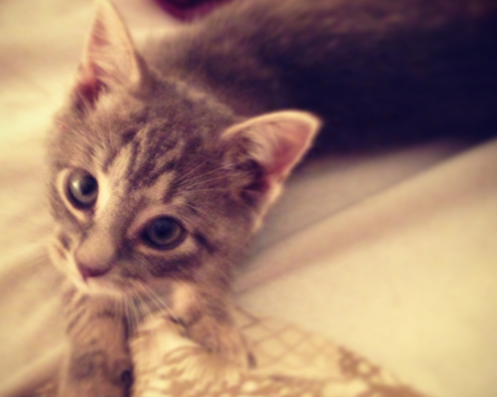
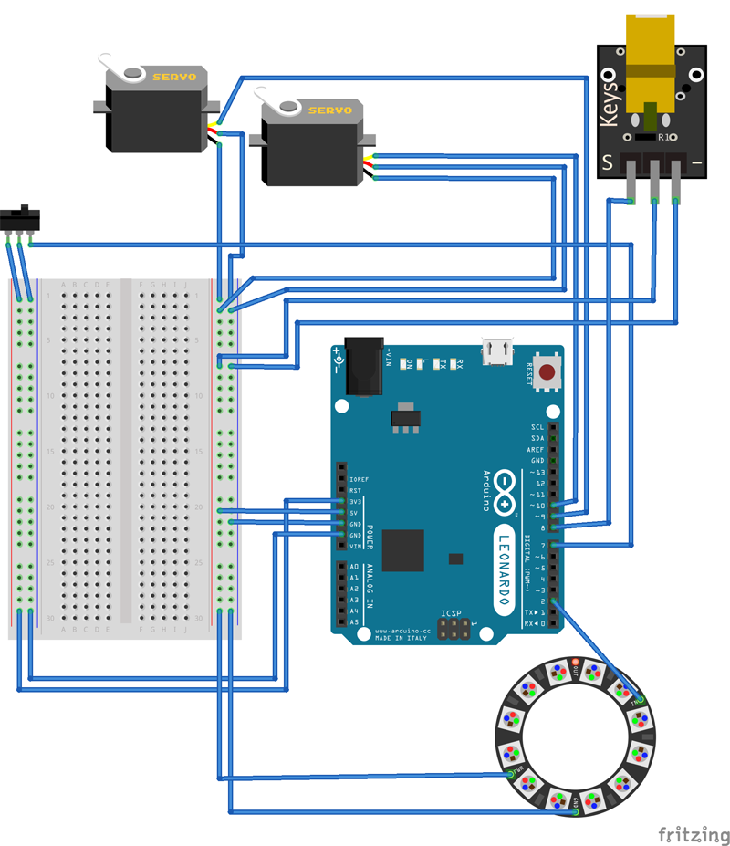

## Stella

**It's a laser a I build for my cat, Stella:**

### Parts list
<li>I used the now discontinued [Laser Module](https://www.sparkfun.com/products/retired/8654) from Sparkfun. However, you can use the [TTL Laser Diode]("https://www.adafruit.com/products/1056") by Adafruit</li>

<li>[NeoPixel Ring - 12x](http://www.adafruit.com/products/1643 "NeoPixel Ring")</li>

<li>[Pan/Tilt Bracket](https://www.sparkfun.com/products/10335 "Pan/Tilt Bracket")</li>

<li>[2 Micro Servos](https://www.sparkfun.com/products/10333 "2 Micro Servos")</li>

<li>[Toggle Switch](https://www.sparkfun.com/products/9276 "Toggle Switch")</li>

<li>[Arduino Leonardo](http://arduino.cc/en/Main/arduinoBoardLeonardo "Arduino Leonardo")</li>

<li>Cat (or Dog)</li>

## Wiring diagram

